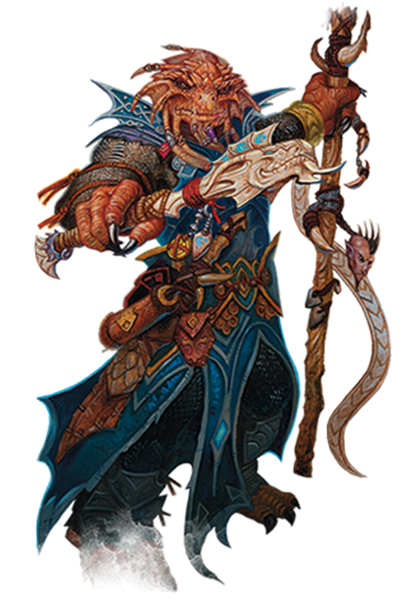

# Races

Humans are the most common people in the worlds of D&D, but they live and work alongside dwarves, elves, halflings, and countless other fantastic species. Your character belongs to one of these peoples.

---

Click on the images below to learn more about each race.

## Dragonborn

Dragonborn look very much like dragons standing erect in humanoid form, though they lack wings or a tail.

## Dwarf

Bold and hardy, dwarves are known as skilled warriors, miners, and workers of stone and metal.

## Elf

Elves are a magical people of otherworldly grace, living in the world but not entirely part of it.

## Gnome

A gnome’s energy and enthusiasm for living shines through every inch of his or her tiny body.

## Half-Elf

Half-elves combine what some say are the best qualities of their elf and human parents.

## Halfling

The diminutive halflings survive in a world full of larger creatures by avoiding notice or, barring that, avoiding offense.

## Half-Orc

Some half-orcs rise to become proud leaders of orc communities. Some venture into the world to prove their worth. Many of these become adventurers, achieving greatness for their mighty deeds.

## Human

Humans are the most adaptable and ambitious people among the common races. Whatever drives them, humans are the innovators, the achievers, and the pioneers of the worlds.

## Tiefling

To be greeted with stares and whispers, to suffer violence and insult on the street, to see mistrust and fear in every eye: this is the lot of the tiefling.

